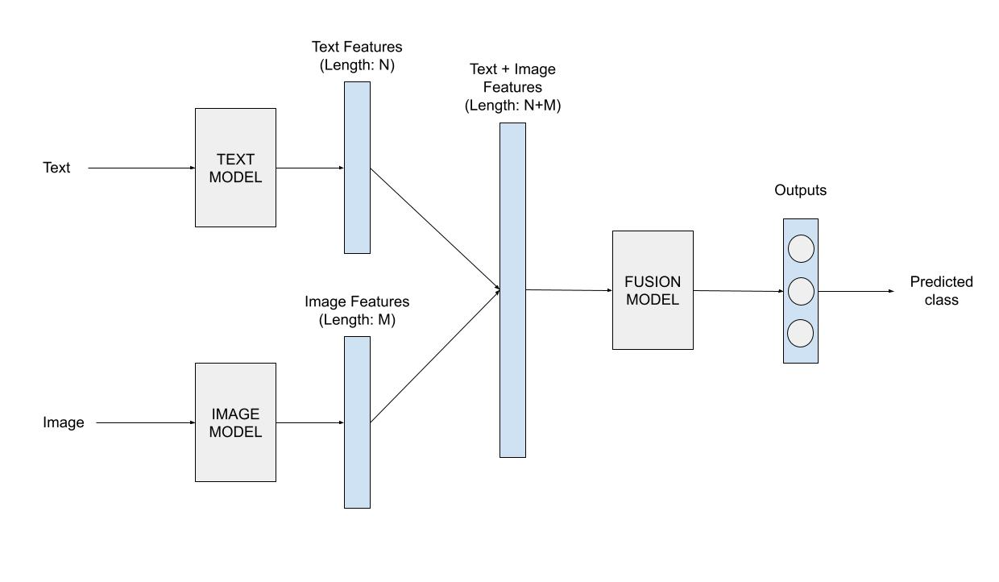
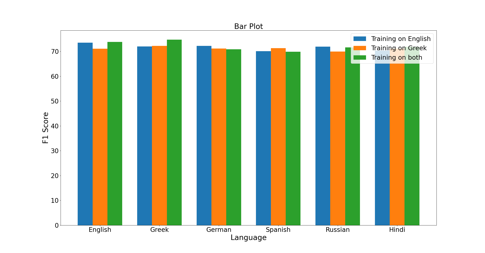

# multimodal-sentiment-analysis

## Summary
Στο παρόν project επιχειρείται η ανάλυση συναισθήματος στο [MVSA-Single dataset](https://mcrlab.net/research/mvsa-sentiment-analysis-on-multi-view-social-data/), το οποίο περιέχει κείμενα και εικόνες. Εποπτικά το προτεινόμενο σύστημα φαίνεται στην εικόνα: 

### Folders
* images: Περιλαμβάνει το σύνολο των εικόνων που χρησιμοποιούνται στο README.

### Files
Εδώ θα εξηγηθούν τα αρχεία που βρίσκονται στο συγκεκριμένο repository. Όσα αρχεία έχουν τη κατάληξη .ipynb έτρεχαν κατά τα πειράματα μέσω του Google Colab, με απαραίτητη τη χρήση κάποιας GPU. Συνεργάζονται άμεσα με το Google Drive από το οποίο ζητούν και στέλνουν αρχεία. Όσα αρχεία έχουν τη κατάληξη .py έτρεχαν locally στον υπολογιστή, χωρίς σημαντικές απαιτήσεις υπολογιστικών πόρων. Σε αυτή τη κατηγορία έχουμε τα αρχεία συναρτήσεων που χρησιμοποιούμε σαν βιβλιοθήκες και τα αρχεία που χρησιμοποιούμε για την εξαγωγή διαγραμμάτων και για τη μετάφραση των κειμένων.
* Konstantinos_gerogiannis_thesis.pdf: Αποτελεί το κείμενο της διπλωματικής εργασίας, όπου περιγράφονται αναλυτικά η θεωρία και τα πειράματα που πραγματοποιήθηκαν. Το αρχείο αυτό είναι γραμμένο στα ελληνικά.
* Konstantinos_gerogiannis_presentation.pptx: Η παρουσίαση της διπλωματικής εργασίας δίνοντας έμφαση στα κυριότερα σημεία της.

## Step 1: Dataset
Αρχικά θα πρέπει να κατεβάσετε το dataset MVSA-Single από το link που υπάρχει στην αρχή της εισαγωγής. Τo dataset θα βρίσκεται σε ένα αρχείο με τον τίτλο MVSA-Single.zip, το οποίο το ανεβάζουμε στο Google Drive ώστε να το επεξεργαζόμαστε άμεσα από το Google Colab. Το dataset είναι βρώμικο και χρειάζεται να γίνει κάποιος καθαρισμός του προτού είναι έτοιμο για χρήση. Συγκεκριμένα πρέπει να εξαχθεί το συνολικό label των ζευγών κειμένου-εικόνας. Αυτό ακριβώς πραγματοποιείται στο notebook με όνομα MVSA dataset.ipynb, όπου μετά την προεπεξεργασία θα πρέπει το dataset να περιέχει 4511 ζεύγη αντί για 4869 που είχε αρχικά. Επίσης το notebook δίνει τη δυνατότητα στο χρήστη να εξάγει αν θέλει μόνο τη πληροφορία που σχετίζεται με τα κείμενα ή με την εικόνα, αντί για τη συνολική. Το συγκεκριμένο notebook μπορεί να χρησιμοποιηθεί και για τον καθαρισμό του MVSA-Multiple, όπου με σωστή εκτέλεση θα προκύψουν 17024 ζεύγη στο αρχείο εξόδου. Ωστόσο η δουλειά αυτή έχει ήδη γίνει και το καθαρισμένο dataset βρίσκεται στα συνοδευτικά αρχεία που χρειάζεται να ανέβουν στο Google Drive.

## Step 2: Predictions from Vader tool (Optional)
Αυτό το βήμα είναι τελείως προαιρετικό καθώς φάνηκε στη πορεία των πειραμάτων πως το συγκεκριμένο εργαλείο που βασίζεται στην απόδοση συναισθήματος με βάση κάποιο λεξικό δε καταφέρνει να ενισχύσει τις συνολικές προβλέψεις του συστήματος. Παρόλα αυτά, διατίθεται το vader_sentiment_scores.ipynb αρχείο που περιέχει τον κώδικα για να αναπαραχθούν οι προβλέψεις του. Οι υπολογισμοί αυτοί έχουν γίνει για όλα τα κείμενα που μας ενδιαφέρουν και βρίσκονται στο φάκελο με τα αρχεία του Google Drive, με όνομα vader_values.npy.

## Step 3: Understanding created libraries
Οι βιβλιοθήκες που δημιουργήθηκαν βρίσκονται στον φάκελο με τα αρχεία που πρέπει να ανέβουν στο Drive, στον φάκελο με όνομα Functions. Στον φάκελο αυτό υπάρχουν 4 διαφορετικά αρχεία:
* text_functions.py: Συναρτήσεις που σχετίζονται με την προεπεξεργασία των κειμένων
* image_functions.py: Συναρτήσεις που σχετίζονται με την προεπεξεργασία των εικόνων
* multimodal_functions.py: Συναρτήσεις που σχετίζονται με το μοντέλο συνένωσης. Περιέχει τις κλάσεις των 4 προτεινόμενων αρχιτεκτονικών συνένωσης και την αρχικοποίηση του μοντέλου που επιλέγουμε.
* sentiment_analysis_functions.py: Συναρτήσεις που χειρίζονται τη συνολική λειτουργία του συστήματος. Εδώ ορίζονται και αρχικοποιούνται τα μοντέλα κειμένου και εικόνας. Επίσης γίνεται η εκμάθηση των μοντέλων, η πρόβλεψη των μοντέλων, η εξαγωγή των χαρακτηριστικών, η δημιουργία των dataloaders.

## Step 4: Create the multimodal system
Όλη η διαδικασία της εκπαίδευσης και δημιουργίας προβλέψεων του συστήματος πραγματοποιείται στο notebook sentiment_analysis_full_process.ipynb. Στο ίδιο notebook εκτελούνται και όλα τα υπόλοιπα πειράματα που αναφέρονται στη διπλωματική και θα εξηγηθούν ένα προς ένα στη συνέχεια. Όπου υπάρχει η σήμανση optional σημαίνει πως η χρήση του συγκεκριμένου κώδικα είναι προαιρετική και επιλέγεται ανάλογα με το πείραμα που θέλουμε να εκτελέσουμε.

Αν κανείς θελήσει να τρέξει όλο το notebook, τότε θα δημιουργήσει όλο το σύστημα από την αρχή. Πιο συγκεκριμένα, στην αρχή θα επιλέξει τα μοντέλα και τις υπερπαραμέτρους που θέλει να χρησιμοποιήσει. Σε πρώτη φάση θα προσαρμοστεί το μοντέλο του κειμένου και θα υπολογιστούν τα χαρακτηριστικά για κάθε κείμενο. Στη συνέχεια θα γίνει το ίδιο με το μοντέλο εικόνας και τέλος τα υπολογισμένα χαρακτηριστικά θα ενοποιηθούν σε έναν πίνακα και θα χρησιμοποιούν στην εκπαίδευση του μοντέλου συνένωσης. Γενικά τα χαρακτηριστικά αποθηκεύονται στους πίνακες text_logits.npy και image_logits.npy. 

Ο χρήστης έχει επίσης την επιλογή να μην υπολογίσει αναλυτικά τα χαρακτηριστικά αν το έχει ήδη κάνει σε προηγούμενο πείραμα και μπορεί να τα φορτώσει, δίνοντας στο colab το αντίστοιχο αρχείο, πχ text_logits.npy. Για τα προτεινόμενα μοντέλα έχουμε αποθηκεύσει τους πίνακες των χαρακτηριστικών και τους έχουμε αποθηκεύσει στον φάκελο Google Colab.

## Step 5: Translate texts for different languages
Δημιουργήσαμε κώδικα στη Python ο οποίος μεταφράζει τα αγγλικά κείμενα σε διαφορετικές γλώσσες, συγκεκριμένα στα ελληνικά, γερμανικά, ρωσικά, ισπανικά και ινδικά. Ο κώδικας βρίσκεται στο αρχείο με όνομα translator.py, μέσα στον φάκελο Python codes. Η διαδικασία της μετάφρασης έχει ήδη γίνει αποτελεσματικά και τα μεταφρασμένα κείμενα βρίσκονται στον φάκελο translations.

## Step 6: Experiments using different languages
Εδώ θα δούμε πως διεξάγουμε τα πειράματα όπου χρησιμοποιούνται διαφορετικές γλώσσες πέραν των αγγλικών. 
1. Φορτώνουμε τα ήδη υπολογισμένα χαρακτηριστικά των εικόνων.
2. Αλλάζουμε το μοντέλο κειμένου από roberta-base σε roberta-base-xlm.
3. Για το πείραμα εκπαίδευσης στα αγγλικά, χρησιμοποιούμε τα αγγλικά κείμενα και εκτελούμε κανονικά τη διαδικασία προσαρμογής του μοντέλου. Αφού τελειώσει το fine-tuning του μοντέλου, μπορούμε να επιλέξουμε οποιαδήποτε άλλη γλώσσα από τα ελληνικά, τα γερμανικά, τα ρωσικά, τα ισπανικά και τα ινδικά, στο κομμάτι κώδικα με τίτλο "Applying another language". Έτσι θα υπολογιστούν τα χαρακτηριστικά στη νέα αυτή γλώσσα και μπορούν να χρησιμοποιηθούν αμέσως μετά στο μοντέλο συνένωσης.
4. Για το πείραμα εκπαίδευσης στα ελληνικά, πρέπει στην αρχή να επιλεχθεί το κελί που φορτώνει τα ελληνικά κείμενα και αντικαθιστά τα αγγλικά. Όλη η υπόλοιπη διαδικασία που αναφέρθηκε προηγουμένως παραμένει η ίδια.
5. Για το πείραμα εκπαίδευσης και στις δύο γλώσσες, πρέπει αρχικά να φορτώσουμε και τα κείμενα αγγλικών και τα κείμενα ελληνικών. Επιπλέον θα πρέπει στο κελί εκπαίδευσης του μοντέλου κειμένου να κάνουμε uncomment τις σημειωμένες γραμμές που αναφέρονται στην επεξεργασία των ελληνικών κειμένων και τη συνένωσή τους με τα αγγλικά σε έναν ενιαίο πίνακα.

## Step 7: Comparing different languages
Για τη σύγκριση των διαφορετικών γλωσσών στα 3 πειράματα που αναφέραμε προηγουμένως, δημιουργήθηκε ένα μικρό python script που είναι μαζεμένα όλα τα αποτελέσματα και συνοψίζονται σε bar chart. Το αρχείο έχει όνομα comparing_languages.py. Τα αποτελέσματα φαίνονται στην εικόνα που ακολουθεί:

## Step 8: Comparing BERT with Greek BERT
Εδώ πρέπει προσεκτικά να διεξάγουμε το κάθε πείραμα. Κρατάμε παντού τα ίδια χαρακτηριστικά εικόνας, προσέχουμε τη γλώσσα που επιλέγουμε μεταξύ αγγλικών και ελληνικών και θυμόμαστε σε κάθε πείραμα να αλλάξουμε το μοντέλο, όποτε χρειάζεται. 

## Step 9: Image augmentations
Για να ελέγξουμε το πως συμπεριφέρεται το σύστημα στην αλλαγή των βημάτων προεπεξεργασίας των εικόνων, μπορούμε να παίξουμε με αυτά. Σε κάθε πείραμα παίρνουμε έτοιμα τα υπολογισμένα χαρακτηριστικά των κειμένων και απλά αλλάζουμε τις γραμμές κώδικα που αναφέρονται στο train_transforms του notebook. 

## Step 10: Custom dataset
Δημιουργούμε το dataset από ζεύγη κειμένου-εικόνας από το Twitter στα ελληνικά. Γίνεται annotation από 2 annotators και για να προκύψουν οι τελικές ετικέτες προτείνονται 3 μέθοδοι ώστε να αντιμετωπιστούν οι συγκρούσεις:
1. Ο πρώτος annotator επανελέγχει τις συγκρούσεις και επιλέγει ανάμεσα στα δύο συναισθήματα.
2. Τα ζεύγη που προκαλούν συγκρούσεις εξαιρούνται από το dataset.
3. Οι συγκρούσεις επιλύονται με την ίδια μέθοδο καθαρισμού του MVSA-Single dataset.
Ως πιο αποδοτική αποδείχτηκε η τρίτη μέθοδος. Το αρχείο με τα labels ονομάζεται custom_dataset_labelling.xlsx και συνεργάζεται άμεσα με το notebook custom_dataset_testing.ipynb. Για να λειτουργήσει σωστά το notebook πρέπει ο χρήστης να έχει ήδη αποθηκεύσει κάπου τα μοντέλα που έχει προσαρμόσει στο dataset. Το dataset μπορεί να το αποκτήσει κανείς από το Hugging Face: [Greek Twitter Multimodal Dataset](https://huggingface.co/datasets/kostasGRG/greek-twitter-multimodal-dataset).

## Step 11: Website
Η ιστοσελίδα που δημιουργήθηκε φαίνεται στον φάκελο website. Ο υποφάκελος templates περιέχει τους html κώδικες που σχηματίζουν τη μορφή της ιστοσελίδας. Ο φάκελος models θα πρέπει να περιέχει τα μοντέλα κειμένου εικόνας και συνένωσης ώστε να φορτωθούν και να χρησιμοποιηθούν στον κώδικα. Στον φάκελο static βρίσκεται το μικρό javascript αρχείο, το css αρχείο με τα χρώματα και τα επιλεγμένα styles και ο φάκελος uploads όπου αποθηκεύονται οι εικόνες που ανεβάζουν οι χρήστες. Επιπλέον υπάρχουν τα 4 python αρχεία που υλοποιούν τον FLASK server πάνω στον οποίο τρέχει η ιστοσελίδα.
